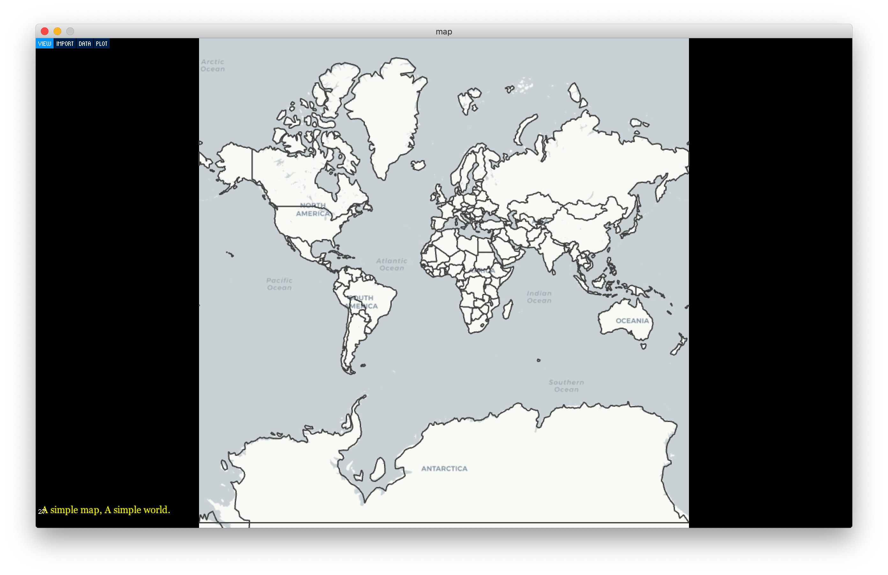
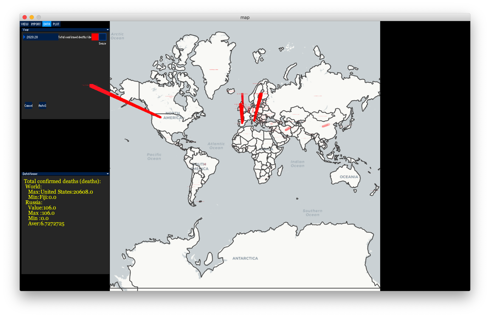
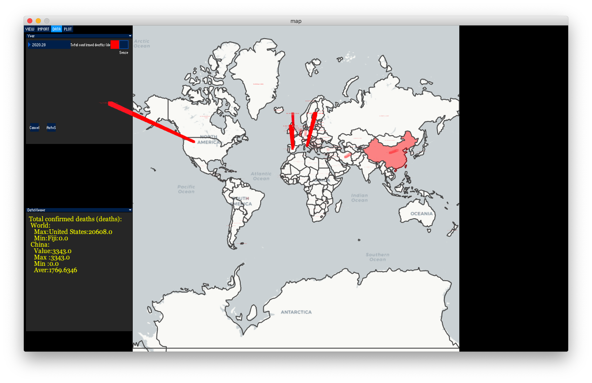
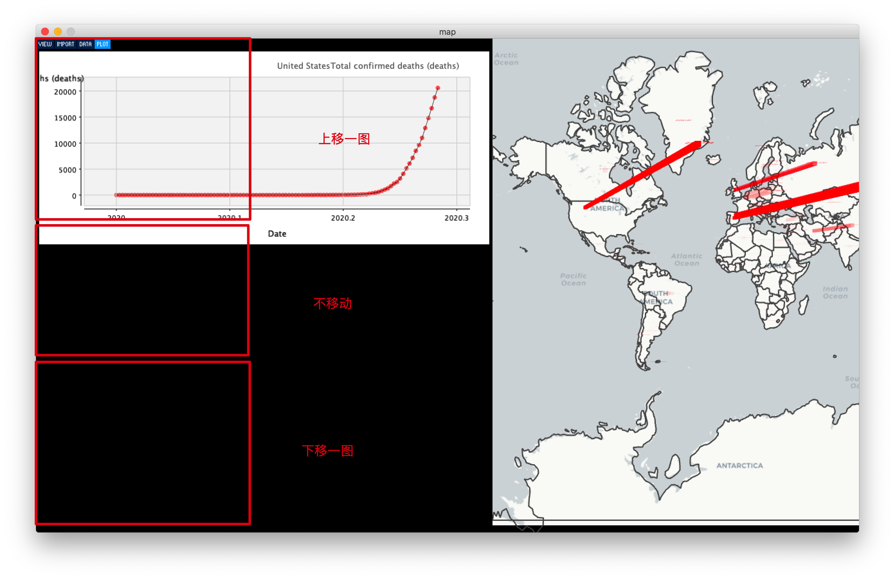

# My map

wasd控制地图3D视角
上下左右键 和 鼠标拖动地图
鼠标双击 或滚轮 可以缩放地图
m键切换音乐模式 （asdfghjkl;'键发出不同频率正弦波）

c键 切换地图
h键 回到初始状态

点击IMPORT键

 第一栏选择文件导入 点击import确认
 第二栏选择数据类型 点击comfirm确认

year栏 年份上下拖动时间框选择时间即可改变数据年份 右边会动态显示数据

时间框左侧 sense框 可以输入时间框随拖动时的时间改变步进大小
>当数据包含年月日信息时 此处应调整为0.001 以获得最佳体验

时间框左侧 颜色按钮 按下后可以显示数据色层图，此色层标红仍然为动态数据

Year栏下"Cancel"键可以取消柱状图显示

"AutoS"键可以自动变化年分 此时年分应手动调整至最小或希望的起始点为佳

地图区域的自动标红 可以按"f"键冻结 以方便查看其他数据 和 图表布局

点击"PLOT"键 绘制图表

遇到大于2个以上的图表则无法完全显示 此时鼠标移至图示大致标红区域触发图表上下移动，每次移动均需从不移动的中间区域滑至上方或下方。